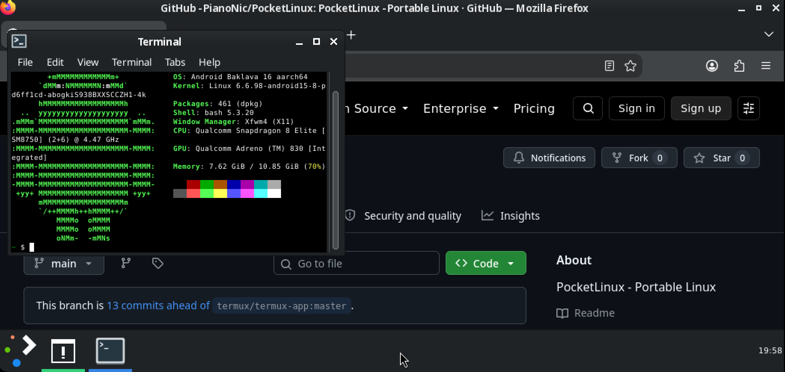

<p align="center">
  
</p>
<p align="center">
  <strong>Pocket Linux</strong><br/>
  A real Linux desktop in your pocket.
</p>
<p align="center">
  <a href="https://github.com/PianoNic/PocketLinux"></a>
  <a href="https://github.com/PianoNic/PocketLinux/releases"></a>
  
  
  
</p>

---

> **Heads up:** Pocket Linux is in early development. It is built and tested on a Galaxy S25 Ultra
> (Snapdragon 8 Elite). Other arm64 phones should work but are untested. The first start downloads
> the ready-made desktop. The optional developer tools add about 3 GB and 15 minutes.

## What is Pocket Linux?

Pocket Linux turns your phone into a Linux desktop. Open the app and it boots straight into XFCE:
windows, a panel, Firefox, a terminal, your dev tools. No terminal app to set up, no separate
display app, no root and no unlocked bootloader.

Under the hood it is [Termux](https://github.com/termux/termux-app) with
[Termux:X11](https://github.com/termux/termux-x11) built in, trimmed down to a single boot screen
and running on the regular Termux package repositories.

<p align="center">
  
</p>

## Features

- **Boots into the desktop** - the app has one screen that sets everything up once, then every start
  opens XFCE directly.
- **Display built in** - the X server runs inside the app, no Termux:X11 install needed.
- **GPU accelerated** - on Adreno phones the whole desktop runs on the GPU (Turnip and Zink),
  with the CPU as fallback on other phones or if the driver misbehaves.
- **Fits any screen** - resolution follows the window and the scale follows the screen density:
  portrait, landscape, split screen and external monitors.
- **Plasma look** - Breeze Dark (or light) theme, Plasma's Scarlet Tree wallpaper, one bottom
  panel with a dock-like taskbar.
- **App store** - Synaptic, to search for and install any of the Termux packages.
- **Dev tools on request** - Node, Angular CLI, Python, clang, Rust, code-server and **.NET 10**
  (`dotnet new`, `build` and `run` work). One switch at setup, or `desktop-setup --dev` later.
- **Survives Android** - stays under Android 12+'s process limit, no developer options needed.
- **Next to Termux** - own app ID (`ch.pocketl`), so it installs alongside Termux without clashing.
- **Quiet** - one low-priority notification with Display settings and Shut down, nothing else.

## Installation

1. Download the latest APK from the [Releases](https://github.com/PianoNic/PocketLinux/releases) page.
2. Install it and open **Pocket Linux**.
3. Keep the app open for the first setup (needs internet, and about 3 GB more with the developer tools).

Updates install over the existing app and keep your files.

## Inside the desktop

| Command | What it does |
| --- | --- |
| `desktop` | Start or repair the desktop |
| `desktop-theme dark` / `light` | Reapply the Plasma-like look |
| `gpu <program>` | Run one program with GPU acceleration, also when the desktop runs on the CPU |
| `touch ~/.termux/no-gpu` | Keep the desktop on the CPU (remove the file to go back to the GPU) |
| `desktop-setup [--dev]` | Run the first-start setup again, `--dev` adds the developer tools |
| `displays` / `desktop <id>` | Put the desktop on another display (needs Shizuku) |

<details>
<summary><strong>Building from source</strong></summary>

The X server has to be built on Linux, so on Windows the build runs in WSL.

One time, in WSL: JDK 17+, `bison`, `rsync`, `gcc-aarch64-linux-gnu`, and an Android SDK in
`~/android-sdk` with platform 36, build-tools 36, NDK 29.0.14206865 and CMake 3.22.1.

```bash
git clone --recurse-submodules https://github.com/PianoNic/PocketLinux
wsl -d Debian -- bash /mnt/c/Coding/PocketLinux/build-in-wsl.sh
# -> dist/pocket-linux-v<version>.apk
```

Keep LF line endings (`.gitattributes` does that): the X server's patches do not apply to CRLF files.

**Releases.** Every push to `main` is built by GitHub Actions. Publishing a GitHub release with a tag like `v0.2.0`
builds the APK with that version, signs it and attaches it to the release. Tags must keep going up,
`versionCode` is `major*1000000 + minor*1000 + patch`.

The release also builds the pre-installed system (`scripts/build-system-image.sh`): the app's own
first-run setup, run inside the Termux Docker image on an arm64 runner and packed like a Termux
bootstrap. The release APK downloads it on first start. Builds without one fall back to the plain
Termux bootstrap and install the desktop package by package.

Signing uses the repo secrets `POCKET_KEYSTORE_BASE64`, `POCKET_KEYSTORE_PASSWORD`,
`POCKET_KEY_ALIAS` and `POCKET_KEY_PASSWORD`, locally a `keystore.properties` in the repo root
(ignored by git). Debug builds use the public Termux test key and cannot update a release install.

</details>

<details>
<summary><strong>How it works</strong></summary>

**Own app ID.** Termux packages have `/data/data/com.termux/files/usr` compiled into their programs,
libraries and scripts. `ch.pocketl` has exactly as many characters as `com.termux`, so the path can
be swapped byte for byte, even inside compiled programs, without shifting anything. The base system
is rewritten while it is unpacked (`Relocator.java`), every later package goes through an apt hook
that rewrites and repacks it right before dpkg runs (`relocate-debs`). The app ID therefore has to
stay 10 characters long.

**Process limit.** The session drops the power manager, notification daemon, gvfs, thumbnailer and
agents, Firefox runs without Fission and with two content processes, and leftovers from crashed
sessions are cleaned up through `/proc`. The whole desktop with two Firefox windows stays around 19
processes.

**.NET.** The .NET runtime keeps its named mutexes under a hardcoded `/tmp`, which Android does not
have. `glibc-shim/tmp-redirect.c` is loaded through glibc's `ld.so.preload` (so bionic programs are
untouched) and sends `/tmp/...` to `$TMPDIR`. The SDK's own programs are pointed at Termux's glibc
loader the first time `dotnet` runs.

| Path | What |
| --- | --- |
| `app/src/main/java/com/termux/app/BootActivity.java` | The boot screen: install, setup, logs |
| `app/src/main/java/com/termux/app/DesktopService.java` | Keeps the desktop alive, watchdog |
| `app/src/main/java/com/termux/app/PocketDisplay.java` | Display defaults and automatic scale |
| `app/src/main/java/com/termux/app/Relocator.java` | Moves Termux paths to this app's ID |
| `app/src/main/assets/desktop/` | First-run setup, `desktop`, `desktop-theme`, `gpu`, apt hook |
| `external/termux-x11` | Termux:X11 (X server and display), built in as a library |
| `glibc-shim/` | `/tmp` redirect for .NET |

</details>

## License

[GPLv3](LICENSE.md), like [Termux](https://github.com/termux/termux-app) and
[Termux:X11](https://github.com/termux/termux-x11), which it is built on.

---

<p align="center">Made with care by <a href="https://github.com/PianoNic">PianoNic</a></p>
